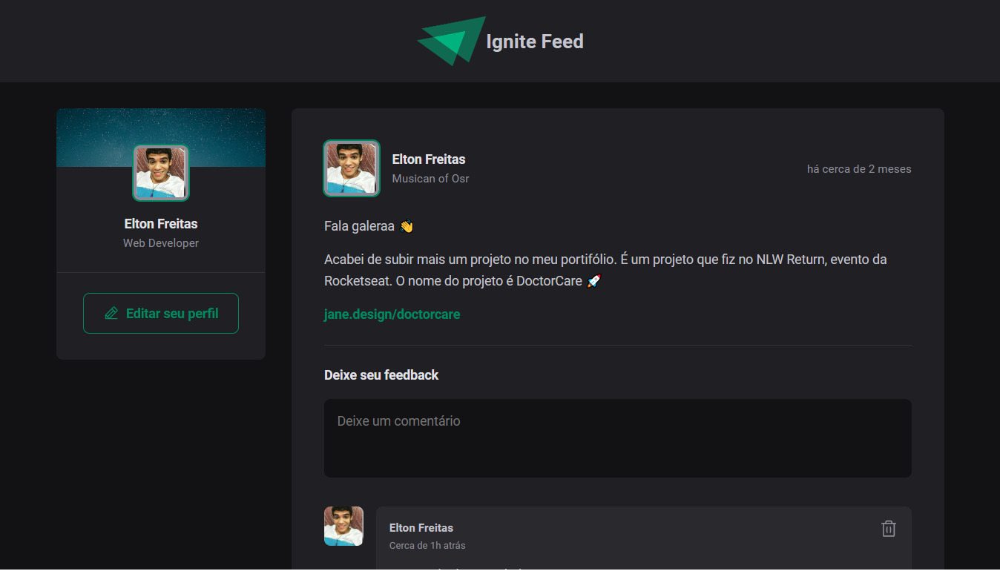

### Preview


<hr/>

### 🛠️ Technologies 
React Native <br/>
Nativewind <br/>
Shadcn/ui <br/>
<hr/>

## 🧲 Requirements 
Git<br/>
Node.js <br/>
NPM / YARN
<hr/>

## Installation

```
$ git clone https://github.com/eltonfreitasx/projeto-rocketseat-Timer.git

$ npm i 

$ npm run dev 
```

The application will open in the browser on  http://localhost:5173/

